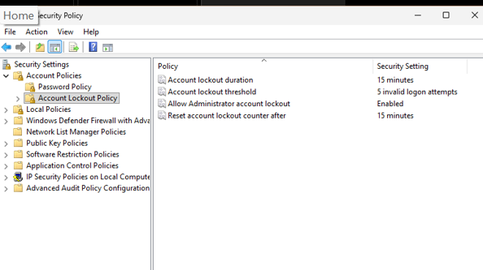
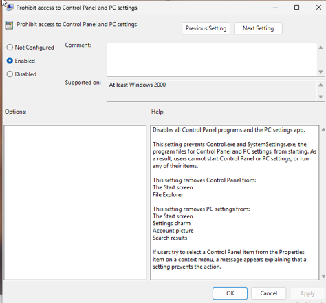
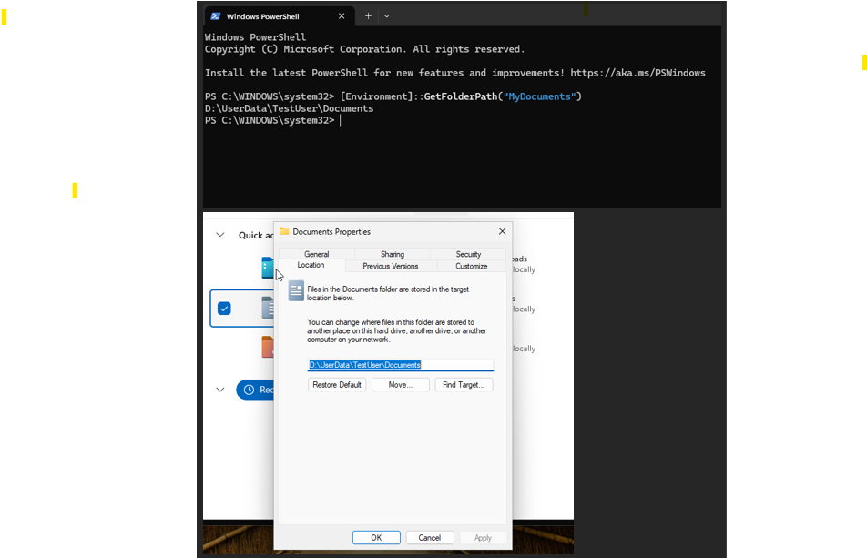
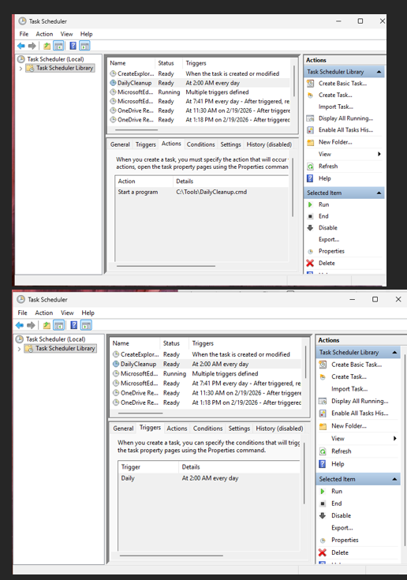
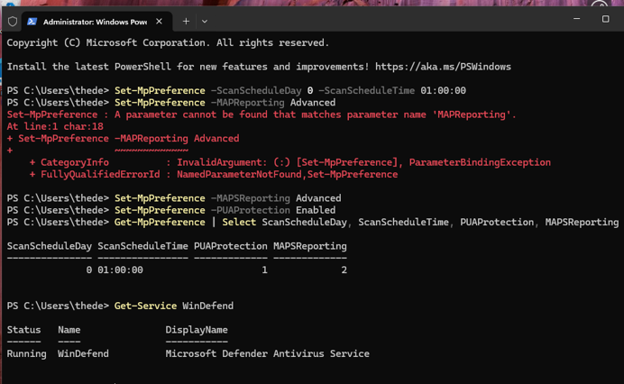
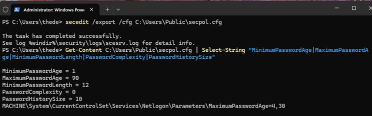

# Local Policies, Security, and Automation

## Project Overview

This project demonstrates hands-on Windows 11 endpoint administration and security configuration in a virtual lab environment. The goal was to apply local security policies, restrict standard user capabilities, automate system maintenance and Microsoft Defender tasks, and verify configurations using PowerShell and Windows logs.

## Environment

- Windows 11 Pro
- VMware Workstation
- Windows PowerShell
- Local Security Policy
- Local Group Policy Editor
- Task Scheduler
- Microsoft Defender
- Event Viewer

## Skills Demonstrated

- Local user and account management
- Password and account lockout policy configuration
- Local Group Policy configuration
- User access restrictions
- Folder redirection
- User Account Control (UAC) hardening
- Windows Task Scheduler
- Microsoft Defender configuration
- PowerShell administration
- Windows Event Log analysis

## Lab Activities

### 1. User Account Management

Created a standard local user account to test administrative restrictions and security policies.

### 2. Password and Account Lockout Policies

Configured local security policies including:

- Minimum password length of 12 characters
- Password complexity requirements
- Password history enforcement
- Maximum and minimum password ages
- Account lockout after 5 invalid login attempts
- 15-minute account lockout duration

  #### Configuration Evidence

The following screenshot shows the configured local password and account lockout policies.

### 3. Local Group Policy

Used Local Group Policy to restrict standard-user access to administrative features, including Control Panel and system settings.

Additional restrictions were tested to limit access to administrative tools.

#### Configuration Evidence

The following screenshot shows the Local Group Policy configured to prohibit standard-user access to Control Panel and PC settings.

### 4. Folder Redirection

Configured folder redirection to store user documents on a separate virtual disk and verified the new document location using PowerShell.

#### Verification

PowerShell and the Documents folder properties were used to verify that the user's Documents folder was redirected to the configured location.

### 5. User Account Control

Configured UAC security settings to limit unauthorized elevation and strengthen administrative controls.

### 6. Automated Maintenance

Used Windows Task Scheduler to create an automated disk-cleanup task.

#### Configuration Evidence

Task Scheduler was configured to run the DailyCleanup task automatically at 2:00 AM each day.

### 7. Microsoft Defender

Configured Microsoft Defender settings and scheduled antivirus scans using PowerShell.

#### Configuration and Verification

Microsoft Defender settings were configured and verified using PowerShell. During configuration, an incorrect PowerShell parameter generated an error. The parameter was corrected, and the resulting Defender settings and service status were successfully verified.

### 8. Verification and Logging

Verified configurations using:

- PowerShell
- Event Viewer
- Task Scheduler
- Local Security Policy
- Microsoft Defender logs

#### Security Policy Verification

The effective Windows security policy was exported and reviewed using PowerShell to verify password age, minimum password length, and password history settings.

## Key Takeaways

This project strengthened my understanding of Windows endpoint administration and demonstrated how local security policies, access controls, automation, PowerShell, and logging can be used together to secure and manage Windows systems.

## Screenshots

Screenshots documenting the configurations and verification steps will be included in this project.
